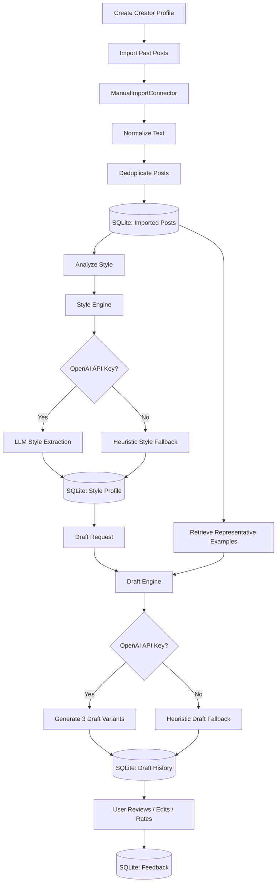

# Creator Voice Studio

Creator Voice Studio is a local-first web app for learning a brand or creator's writing style from past social posts, then drafting new captions, X posts, and short scripts in that same voice.

## Product Idea

Most AI caption tools produce generic content. Creator Voice Studio is designed around a different workflow:

1. Import past posts from X or Instagram.
2. Analyze the creator's voice, tone, formatting, hooks, CTAs, and recurring language.
3. Build a visible style profile the user can inspect.
4. Generate multiple draft options for new topics.
5. Let the user edit, rate, and reuse the best drafts.

The goal is not to replace the creator. The goal is to act like a personal content assistant that understands their style and helps them draft faster.

## Planned Architecture

- `apps/web` — polished Next.js frontend for profiles, imports, voice cards, and draft generation.
- `apps/api` — FastAPI backend for profile management, post imports, style analysis, draft generation, and feedback.
- `SQLite` — local storage for profiles, imported posts, learned style profiles, and generated drafts.
- `OpenAI API` — style extraction and draft generation.
- `ManualImportConnector` — paste, CSV, or JSON imports for v1.
- `XConnector` and `InstagramConnector` — OAuth-ready connector placeholders for future live imports.

## Core Workflow

```text
Past Posts
  -> Clean + Normalize
  -> Learn Style Profile
  -> Store Voice Traits + Examples
  -> Generate Platform-Aware Drafts
  -> User Edits + Feedback
  -> Improve Future Drafts
```

## Current Backend Flow



## Current Implementation

- FastAPI app with profile, import, style-analysis, draft-generation, and feedback routes.
- SQLModel/SQLite persistence for creators, imported posts, style profiles, and draft history.
- Manual import connector that accepts pasted text, CSV, or JSON.
- Placeholder X and Instagram OAuth connectors for future live social imports.
- OpenAI wrapper with local heuristic fallbacks when no API key is configured.
- Prompt builders for style extraction and platform-aware draft generation.
- Next.js frontend shell for profile creation, post import, voice analysis, and draft generation.

## Run Locally

Install backend dependencies:

```bash
python -m pip install -r apps/api/requirements.txt
```

Install frontend dependencies:

```bash
npm --prefix apps/web install
```

Start the API:

```bash
npm run dev:api
```

Start the web app in a second terminal:

```bash
npm run dev:web
```

Then open `http://localhost:3000`.

### One-command local launcher on Windows

```powershell
npm run dev:local
```

This opens separate API and web terminals. Keep both running while using the demo.

### Optional demo seed

With the API running, seed a demo creator, imported posts, learned style profile, and one draft:

```bash
npm run demo:seed
```

After seeding, refresh the web app and select `Demo Creator`.

## V1 Scope

- Local personal tool.
- Writing-style voice only.
- Manual imports for X and Instagram content.
- Draft generation for X posts, Instagram captions, and short scripts.
- Copy/export workflow instead of direct publishing.

## Later Expansion

- Real OAuth import for X and Instagram.
- Audio narration / text-to-speech.
- Scheduling and publishing.
- Brand guardrails and content approval flows.
- Multi-profile campaign workspace.

## Status

Initial implementation in progress.
