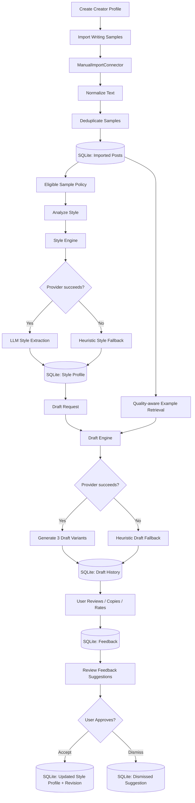

# Creator Voice Studio

Creator Voice Studio is a local-first creator workspace that learns a brand or creator's writing style from past posts, then helps draft X posts, Instagram captions, and short scripts in that voice.

The app is designed as a polished SaaS-style demo, but runs locally for now. It uses manual imports in v1 and keeps OAuth/social publishing as future expansion.

## What It Does

- Create and manage creator/brand profiles.
- Import writing samples manually from X or Instagram.
- Normalize and deduplicate imported samples.
- Score imported samples with quality labels, warnings, and analysis-inclusion flags.
- Include or exclude samples from future voice learning.
- Analyze samples into a visible creator voice profile.
- Edit the learned voice guide with user-approved guardrails.
- Generate three draft variants for a new topic.
- Copy drafts, rate outputs, and save feedback notes.
- Review feedback-derived voice suggestions before applying them.
- Clear workspace data or delete a profile from the UI.

The goal is not to replace the creator. The goal is to reduce blank-page friction while keeping the user in control of voice, edits, and publishing.

## Current Product Flow

```text
Create Profile
  -> Import Writing Samples
  -> Analyze Voice
  -> Generate Draft Variants
  -> Copy / Rate / Add Feedback
  -> Review Feedback Suggestions
  -> Accept / Dismiss Voice Guide Updates
  -> Reuse Draft History
```

## Architecture

```text
apps/web   Next.js creator-studio frontend
apps/api   FastAPI backend
SQLite     Local persistence
Alembic    Versioned schema migrations
OpenAI     Optional style extraction and draft generation
```

### Backend

- `FastAPI` API with profile, import, style, draft, feedback, and admin routes.
- `SQLModel` + SQLite for local storage, with Alembic migrations and creator-owned foreign-key integrity.
- Manual import connector for pasted text, CSV, or JSON.
- Instagram export connector for local Meta/Instagram export JSON or CSV captions.
- Import quality metadata on every sample: `quality_score`, `quality_labels`, `quality_warnings`, and `include_in_analysis`.
- Eligible learning corpus policy: included samples at or above the configured quality threshold.
- Deterministic representative-example retrieval for draft context, using topic relevance, quality, platform match, and recency.
- Editable style profiles, voice suggestions, and style-guide revision history.
- Placeholder X and Instagram connector classes for future OAuth work.
- OpenAI provider adapter with deterministic heuristic fallback when no API key is configured or recoverable provider/JSON/shape failures occur.
- Health/readiness endpoints plus bounded import payloads and a simple single-instance generation rate limit for hosted demos.

### Frontend

- Guided wizard layout: Profile -> Samples -> Analyze -> Draft -> Review.
- Lighter futuristic creator-studio interface.
- Draft generation prioritized as the main workspace.
- Workspace shell split into typed React components under `apps/web/components/workspace`.
- Manual import only; no fake social connection cards yet.
- Instagram export JSON/CSV can be imported through the same samples form.
- Recent samples show quality scores and quick quality tags.
- Recent samples include an Include/Exclude control for future analysis.
- Draft history, copy buttons, feedback notes, and 1-5 ratings.
- Feedback suggestion inbox with accept/dismiss controls.
- Editable voice guide with manual guardrails.
- Workspace admin controls for saving profiles, clearing workspace data, and deleting profiles.
- Vitest coverage for initial workspace load, API failure display, and inclusion updates.

## Current Backend Flow



## API Capabilities

- `GET /api/health` - health check.
- `GET /api/ready` - readiness check for database reachability and migration state.
- `POST /api/profiles` - create a creator profile.
- `GET /api/profiles` - list profiles.
- `PATCH /api/profiles/{creator_id}` - update profile metadata.
- `DELETE /api/profiles/{creator_id}/workspace` - clear imported samples, style profile, drafts, and feedback for a profile.
- `DELETE /api/profiles/{creator_id}` - delete profile and related local data.
- `POST /api/profiles/{creator_id}/imports` - import manual writing samples.
- `GET /api/profiles/{creator_id}/imports` - list imported samples.
- `PATCH /api/profiles/{creator_id}/imports/{post_id}` - include or exclude one imported sample from future analysis.
- `POST /api/profiles/{creator_id}/style/analyze` - analyze imported samples into a style profile.
- `GET /api/profiles/{creator_id}/style` - fetch the current style profile.
- `PATCH /api/profiles/{creator_id}/style` - save editable voice guide changes.
- `GET /api/profiles/{creator_id}/style/revisions` - list recent voice guide revisions.
- `GET /api/profiles/{creator_id}/style/suggestions` - list feedback-derived voice suggestions.
- `POST /api/profiles/{creator_id}/style/suggestions/review` - review ratings and notes for suggested guide edits.
- `PATCH /api/profiles/{creator_id}/style/suggestions/{suggestion_id}` - accept or dismiss a suggestion.
- `POST /api/profiles/{creator_id}/drafts` - generate draft variants.
- `GET /api/profiles/{creator_id}/drafts` - list draft history.
- `PATCH /api/profiles/{creator_id}/drafts/{draft_id}/feedback` - save selected text, rating, and notes.

## Run Locally

### Prerequisites

| Tool | Supported version | Notes |
| --- | --- | --- |
| Python | 3.12 | Pinned in `.python-version`; used by CI. |
| Node.js | 22.x | Pinned in `.nvmrc`; enforced by the web package `engines` field. |
| npm | Bundled with Node 22 | Use `npm ci` for reproducible frontend installs. |

### Bootstrap

macOS/Linux:

```bash
sh scripts/bootstrap.sh
```

Windows PowerShell:

```powershell
powershell -ExecutionPolicy Bypass -File scripts/bootstrap.ps1
```

Bootstrap creates `.venv` if needed, installs backend dependencies, installs frontend dependencies from `apps/web/package-lock.json`, copies env examples only when local env files do not already exist, and runs database migrations.

Start the API:

```bash
npm run dev:api
```

Start the web app in a second terminal:

```bash
npm run dev:web
```

Open:

```text
http://localhost:3000
```

Run all local validation checks:

```bash
npm run verify
```

`verify` runs backend tests, frontend tests, frontend typecheck, and frontend production build.

### One-command Windows launcher

```powershell
npm run dev:local
```

This opens separate API and web terminals. Keep both running while using the app.

### Optional demo seed

With the API running, seed a demo creator, writing samples, learned style profile, and one draft:

```bash
npm run demo:seed
```

Refresh the web app and select `Demo Creator`.

## Environment

Backend environment file:

```bash
cp apps/api/.env.example apps/api/.env
```

The bootstrap scripts do this automatically when `apps/api/.env` does not already exist.

For real OpenAI-powered style extraction and draft generation, add your key to the local backend env file:

```env
OPENAI_API_KEY=your_openai_api_key_here
OPENAI_MODEL=gpt-4o-mini
OPENAI_TIMEOUT_SECONDS=15
MIN_ANALYSIS_QUALITY_SCORE=50
MAX_IMPORT_CHARS=200000
GENERATION_RATE_LIMIT_PER_MINUTE=20
DATABASE_URL=sqlite:///./creator_voice.db
CORS_ORIGINS=http://localhost:3000,http://127.0.0.1:3000
```

Do not commit `apps/api/.env`. It contains secrets and is intentionally ignored by git.

Frontend environment file:

```bash
cp apps/web/.env.example apps/web/.env.local
```

The bootstrap scripts do this automatically when `apps/web/.env.local` does not already exist.

Frontend local env:

```env
NEXT_PUBLIC_API_BASE_URL=http://localhost:8000
```

Do not commit `apps/web/.env.local`.

Important variables:

- `OPENAI_API_KEY` - enables OpenAI style extraction and draft generation; without it, local heuristic fallbacks are used.
- `OPENAI_MODEL` - defaults to `gpt-4o-mini`.
- `OPENAI_TIMEOUT_SECONDS` - caps a single OpenAI generation attempt before falling back; defaults to `15`.
- `MIN_ANALYSIS_QUALITY_SCORE` - minimum imported-sample quality score for style analysis and draft retrieval; defaults to `50`.
- `MAX_IMPORT_CHARS` - maximum raw import payload length; defaults to `200000`.
- `GENERATION_RATE_LIMIT_PER_MINUTE` - simple per-client draft-generation limit for single-instance demos; defaults to `20`.
- `DATABASE_URL` - keep this local for now; defaults to `sqlite:///./creator_voice.db`.
- `CORS_ORIGINS` - comma-separated allowed API origins.
- `NEXT_PUBLIC_API_BASE_URL` - defaults to `http://localhost:8000`.

### Local Database

The app is intentionally using local SQLite for now. You do not need a production database URL unless the project becomes deployed or multi-user.

Local SQLite is enough for:

- Personal/local demos.
- Imported writing samples.
- Voice profiles and guide revisions.
- Draft history and feedback.

If a production database is needed later, add a separate deployment-only env file or hosting secret instead of committing it to git.

### Database Migrations

Schema changes are versioned with Alembic. Bootstrap runs migrations automatically, but you can run them manually:

```bash
npm run db:upgrade
npm run db:current
npm run db:check
```

Before migrating a real local database with data you care about, copy the SQLite file as a backup. The default local database is `creator_voice.db` when `DATABASE_URL=sqlite:///./creator_voice.db`.

For disposable validation, point migrations at a temporary database:

```bash
DATABASE_URL=sqlite:///./migration_check.db npm run db:upgrade
```

On Windows PowerShell:

```powershell
$env:DATABASE_URL="sqlite:///./migration_check.db"; npm run db:upgrade
```

If `db:check` reports that the current revision is behind the migration head, run `npm run db:upgrade`. If a migration reports orphan creator-owned rows, inspect the database before retrying; the migration intentionally stops rather than guessing how to repair data.

## Tests and Validation

Run backend tests:

```bash
npm run test:api
```

Run frontend typecheck:

```bash
npm --prefix apps/web run typecheck
```

Run frontend tests:

```bash
npm run test:web
```

Run frontend production build:

```bash
npm --prefix apps/web run build
```

Run the same core checks together:

```bash
npm run verify
```

Run the live HTTP smoke test after starting the API:

```bash
npm run dev:api
npm run smoke:api
```

The smoke test validates `/api/health`, profile creation, importing three samples, no-key style analysis, three draft variants, feedback, and profile deletion. Set `API_BASE_URL` if your API is not running at `http://localhost:8000`.

CI runs backend tests, frontend tests, frontend typecheck/build, SQLite migrations, Postgres migrations, and the API container build on pushes to `main` and on pull requests. No `OPENAI_API_KEY` is required; the default validation path uses deterministic heuristic fallback behavior.

Current backend tests cover:

- Full profile -> import -> analyze -> draft -> feedback flow.
- Import quality metadata for X and Instagram samples.
- Style analysis requiring at least 3 eligible samples.
- Include/exclude controls and deterministic quality-aware example retrieval.
- Recoverable OpenAI/provider failures falling back without persisting malformed output.
- Draft generation requiring an analyzed voice profile.
- Editable voice guide updates and feedback-suggestion approval flow.
- Profile edit, workspace clear, and profile delete admin actions.
- Readiness, oversized import rejection, and deployment-foundation safeguards.

Current frontend tests cover:

- Initial profile workspace load.
- API load failure display.
- Sample inclusion/exclusion update behavior.

## V1 Scope

- Local personal/SaaS-demo tool with optional single-instance deployment packaging.
- Writing-style voice only; no audio narration yet.
- Manual X and Instagram sample imports.
- Instagram export-file parsing is supported; live OAuth import is still deferred.
- Copy/export drafts only; no direct publishing.
- OpenAI generation when configured, heuristic fallback otherwise or on recoverable provider failure.
- SQLite locally; Postgres is supported for hosted-demo deployment through the same migrations.

## Future Changes

Deployment foundation docs live in [`docs/DEPLOYMENT.md`](docs/DEPLOYMENT.md) and [`docs/RUNBOOK.md`](docs/RUNBOOK.md). They cover the optional single-instance hosted-demo path without selecting a hosting vendor.

Near-term improvements that can be added without changing the core V1 algorithm:

- Improve the editable voice guide with saved presets, reset-to-analysis, and change history.
- Add better draft history filters by creator, platform, rating, and draft format.
- Expand feedback capture so accepted edits can influence future prompts.
- Add import quality checks for duplicate, too-short, or off-topic writing samples.
- Add export options for drafts, voice guides, and imported sample sets.

Algorithm and system-design decisions to review before implementation:

- Style analysis scoring, evidence weighting, and representative-sample selection.
- Retrieval strategy for choosing which past posts guide each new draft.
- Reuse protection thresholds for warning when drafts are too close to old captions.
- Optional brand safety / approval workflow for teams or SaaS users.
- Fine-tuning, embeddings, or evaluator models if simple prompting is not enough.

Larger expansion paths:

- Real OAuth import for X and Instagram.
- Scheduling and publishing after social account connections are real.
- Multi-profile campaign workspace for agencies or creator teams.
- Audio narration / text-to-speech as a separate voice module later.

## Status

Current state: runnable and testable local-first creator voice studio with a modular Next.js frontend, FastAPI backend, Alembic-managed SQLite schema, optional OpenAI generation with resilient fallback, quality-aware learning/retrieval, regression tests, smoke testing, CI, and optional single-instance deployment docs/container support.
